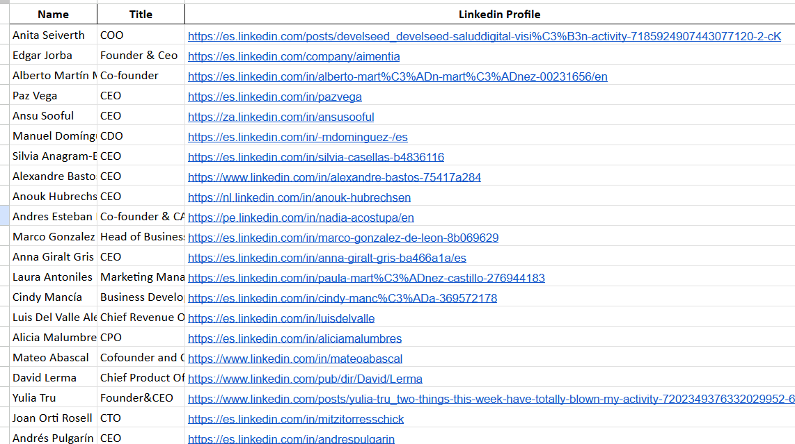

# LinkedIn Profile Enrichment API

Este proyecto proporciona una API simple para encontrar URLs de perfiles de LinkedIn a partir del nombre de una persona, junto con un **Google Apps Script** para integrarlo en Google Sheets y facilitar su uso. La API está desplegada en **Vercel** y puede utilizarse para reclutamiento, prospección de ventas o fines de investigación.

> ⚠️ **Nota**: Esta API depende de resultados públicos de búsqueda en Google y puede tener limitaciones. Usala de manera responsable y en cumplimiento con los términos de servicio de LinkedIn.

---

## 🚀 Features

- 🔎 **API**: Devuelve el primer perfil de LinkedIn para un nombre dado.
- 📄 **Integración con Google Sheets**: Función personalizada para enriquecer nombres con URLs de perfil.
- ⚡ **Ligera y simple**: Construida con FastAPI y desplegada en Vercel.
- 💡 **Gratis para testear**: Disponible sin autenticación por ahora.

---

## 📡 API Details

### Endpoint

- **URL**: `https://fast-api-lk-enrichment-5dpl.vercel.app/linkedin_enrichment`
- **Método**: `GET`
- **Parámetros**:
  - `text` (string, requerido): El nombre a buscar (por ejemplo, `Elon Musk`)
- **Ejemplo de respuesta**:

```json
{
  "Profile URL": "https://www.linkedin.com/in/elon-musk/"
}
```

---

### ⚠️ Limitaciones

- La API usa resultados públicos de Google, por lo que puede fallar o devolver información incorrecta.
- Puede haber bloqueos o límites de uso por parte de Google.
- Para uso en producción, considerá proveedores más robustos como [SerpAPI](https://serpapi.com/).

---

## 📊 Integración con Google Sheets

Podés usar esta API directamente en Google Sheets mediante el siguiente script.

### 📜 Script

```javascript
function getLinkedInProfile(searchText) {
  try {
    var encodedText = encodeURIComponent(searchText);
    var url = `https://fast-api-lk-enrichment-5dpl.vercel.app/linkedin_enrichment?text=${encodedText}`;
    var response = UrlFetchApp.fetch(url, { muteHttpExceptions: true });

    if (response.getResponseCode() !== 200) {
      throw new Error(`Error: ${response.getResponseCode()}`);
    }

    var data = JSON.parse(response.getContentText());
    var profileUrl = data["Profile URL"];

    Logger.log("Perfil de LinkedIn: " + profileUrl);
    return profileUrl || "No se encontraron resultados";
  } catch (error) {
    Logger.log("Error al consultar la API: " + error.message);
    return "Error: " + error.message;
  }
}

// Función personalizada para usar en celdas
function LINKEDIN_PROFILE(searchText) {
  if (!searchText) return "Ingresa un texto de búsqueda";
  return getLinkedInProfile(searchText);
}
```

---

## ✅ Cómo usar en Google Sheets

1. Abrí un Google Sheet.
2. Hacé clic en **Extensiones > Apps Script**.
3. Pegá el script anterior y guardá el proyecto (por ejemplo, llamalo `LinkedIn Enrichment`).
4. Usá la función personalizada:

```excel
=LINKEDIN_PROFILE("Elon Musk")
```

Esto devolverá la URL del perfil o un mensaje de error.

### 🧩 Para aplicar en una columna entera

- Si tenés nombres en `A2:A100`, poné esto en `B2`:

```excel
=LINKEDIN_PROFILE(A2)
```

- Luego arrastrá hacia abajo.

---

